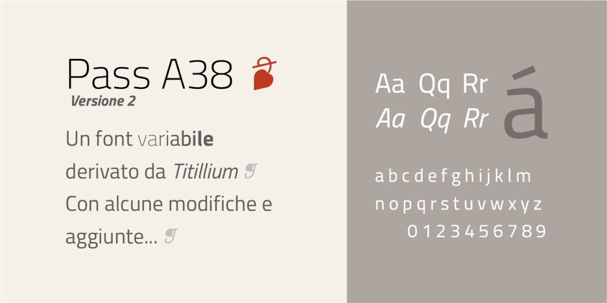

# Pass A38
- Versione 1.2: sistemazione di alcuni caratteri
- Versione 1.15: sistemazione di alcuni caratteri
- Versione 1.0: versione iniziale.

Per maggiori informazioni e per testare il font, vedere la [pagina interattiva](https://m-casanova.github.io/Pass-A38/).

## Descrizione

"Pass A38" ("Lasciapassare A38") è un font variabile derivato da "[Titillium Web](https://fonts.google.com/specimen/Titillium+Web)" dell'Accademia di Belle Arti di Urbino (con alcune modifiche); il font "Titillium Web" è stato adottato per i siti della pubblica amministrazione in Italia.

Il font è rilasciato nei formati WOFF2 e TTF con licenza OFL 1.1 (come già "Titillium Web").
