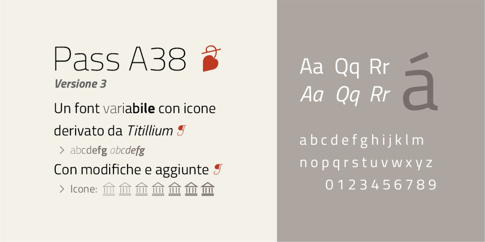
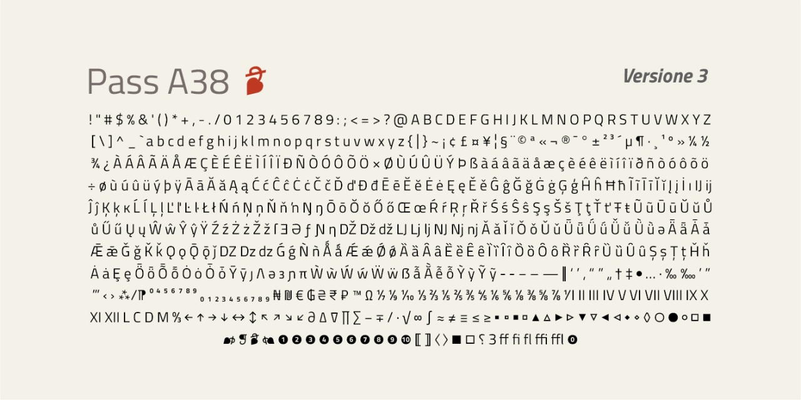
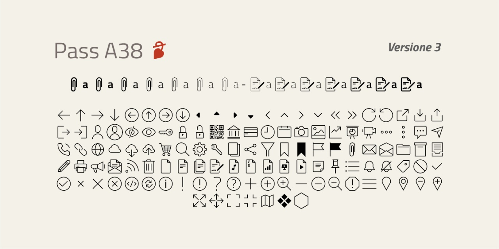
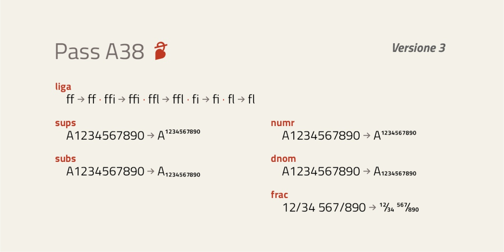
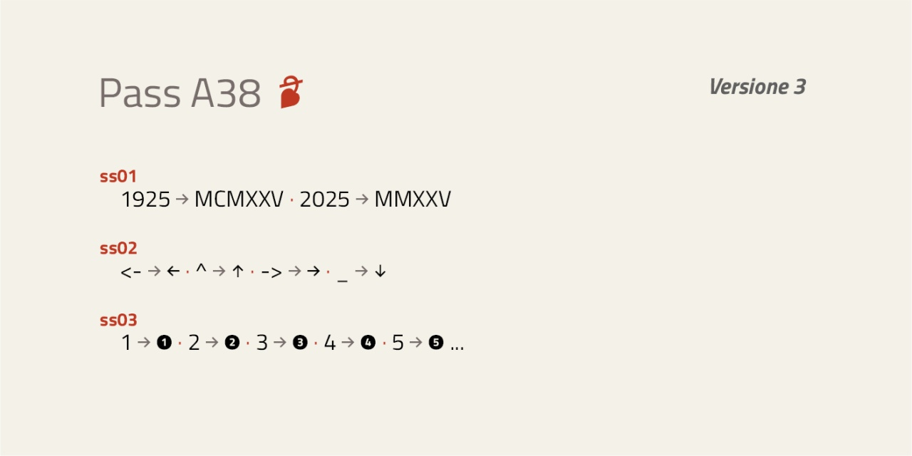
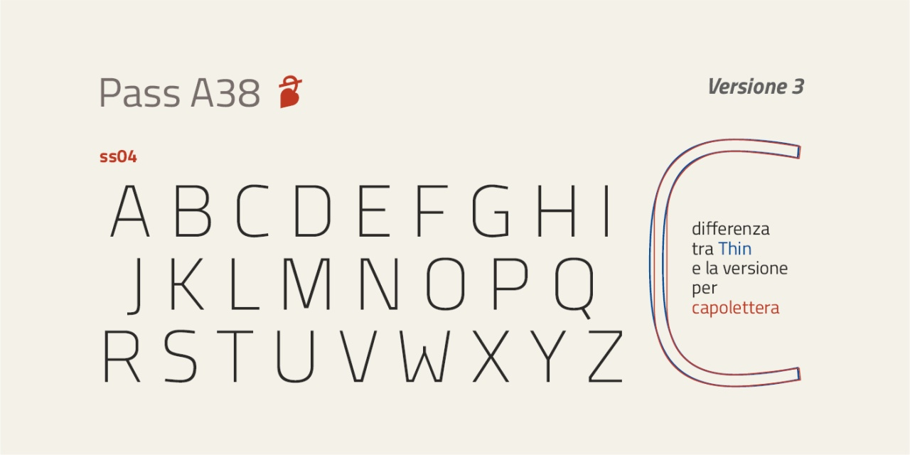
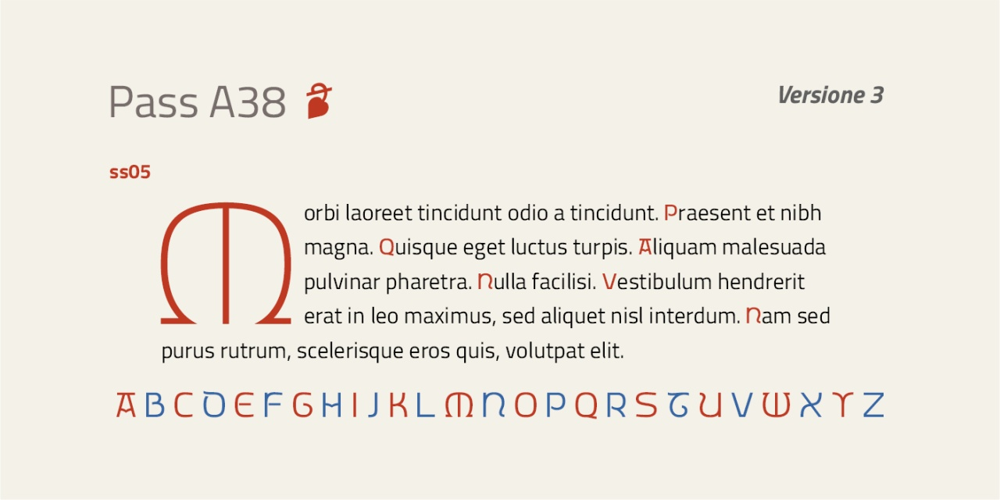

# Pass A38

⟶ __[Download](https://github.com/m-casanova/Pass-A38/releases)__ (OTF, TTF, WOFF, WOFF2, variable TTF, source)

Per maggiori informazioni e per testare il font, vedere la [pagina interattiva](https://m-casanova.github.io/Pass-A38/).

_Pass A38_ ("Lasciapassare A38") è un font variabile derivato da _[Titillium Web](https://fonts.google.com/specimen/Titillium+Web)_ dell'Accademia di Belle Arti di Urbino (con alcune modifiche); il font _Titillium Web_ è stato adottato per i siti della pubblica amministrazione in Italia.

Dalla versione 2.507 sono inserite icone da [UI Kit Italia](https://github.com/italia/design-ui-kit) (rilasciate con licenza [CC BY 4.0 International](https://creativecommons.org/licenses/by/4.0/)) con spessore variabile. Altre icone sono state create appositamente.

Il font è rilasciato nei formati WOFF2 e TTF con licenza OFL 1.1 (come già "Titillium Web").

## Utilizzo
Il font può essere utilizzato tramite un unico file in formato WOFF2 con il seguente codice CSS. Ovviamente il percorso del file deve essere adattato alla specifica situazione.

    @font-face {
        font-family: "Pass A38";
        font-weight: 100 700;
        src: url("Pass_A38.woff2") format("woff2-variations");
    }

Per ottenere correttamente il corsivo con Chrome e Opera, utilizzare il seguente codice CSS.

    em, i { font-variation-settings: "ital" 1; font-style:normal }

## Icone variabili

Le icone variabili hanno uno spessore che si adatta al testo corrispondente.

## Opentype

Come __ss04__ è presente un capolettera sottile derivato da Titillium

Come __ss05__ è stato aggiunto un capolettera per i siti storici (ad esempio, archivi, musei e biblioteche).

# Versioni

- Versione 3.000: risistemazione generale e aggiunta di __ss05__ (capolettera)
- Versione 2.816: fix minore
- Versione 2.815: fix frazioni
- Versione 2.812: fix crenatura e revisione asse 'weight'
- Versione 2.795: fix minori
- Versione 2.792: aggiunta di caratteri
- Versione 2.761: aggiunta di caratteri
- Versione 2.753+2.754: aggiunta dei capolettera come 'ss04', utilizzando le lettere estratte da _Titillium Display_ del progetto originario
- Versione 2.742: aggiunta di caratteri e sistemazione accenti
- Versione 2.511: fix minori
- Versione 2.509: creazione di alcune icone aggiuntive
- Versione 2.507: inclusione di icone da [UI Kit Italia](https://github.com/italia/design-ui-kit) con alcune modifiche (per avere uno spessore variabile) e alcune aggiunte
- Versione 2.122: fix minori
- Versione 2.119: fix diversi per frazioni e aggiunta ə Ə ɜ Ɜ
- Versione 2.117: aggiunta legature
- Versione 2.112: correzione simboli frecce e simbolo ‰
- Versione 2.107: fix minori
- Versione 2.105: correzione simbolo ₹
- Versione 2.102: risistemazione complessiva dei caratteri e aggiunta di alcune caratteristiche
- Versione 1.2: sistemazione di alcuni caratteri
- Versione 1.15: sistemazione di alcuni caratteri
- Versione 1.0: versione iniziale.
